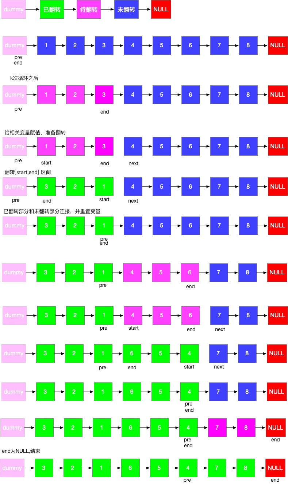

# K个一组翻转链表 解题笔记

难度：Hard

## 解题方法一：迭代法

* 过程图解

* 代码如下：

* 以上过程参考：
  <https://leetcode-cn.com/problems/reverse-nodes-in-k-group/solution/tu-jie-kge-yi-zu-fan-zhuan-lian-biao-by-user7208t/>

* 复杂度计算：
  
  需要翻转的段数为  n/k , 每一段是O(k)   所以总的复杂度是 O(k) *  (n/k) 还是 O(n)

  while的复杂度O(n/k) {
    for循环复杂O(k) +  reverse复杂度O(k) = 2k
  }

## 解题方法二：递归实现

* 一个单链表反转的递归动画

* 代码如下：

