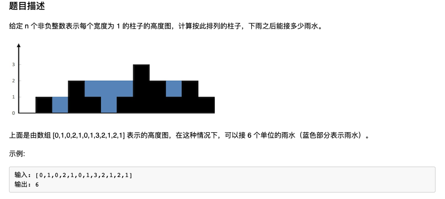
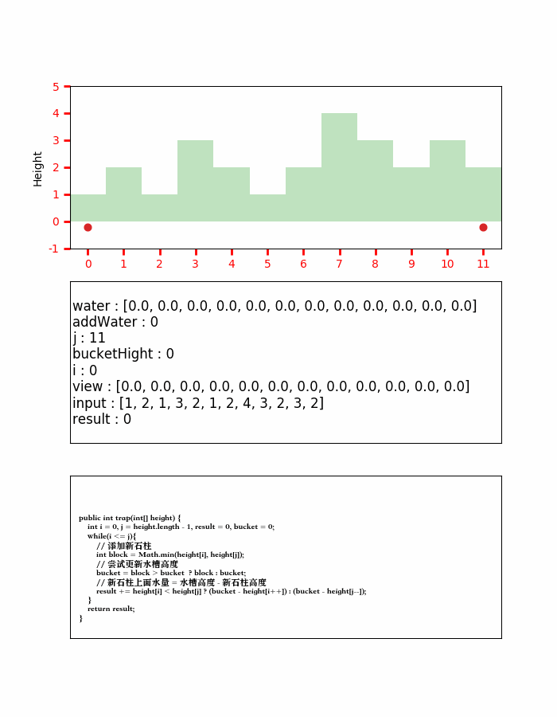
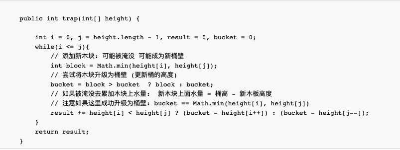
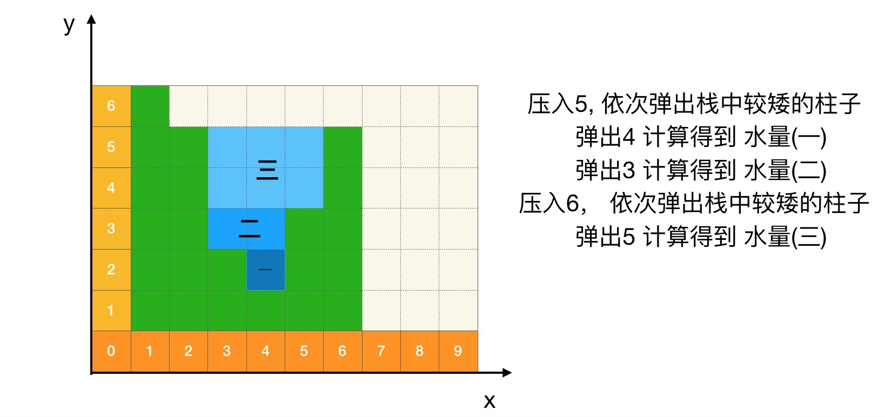
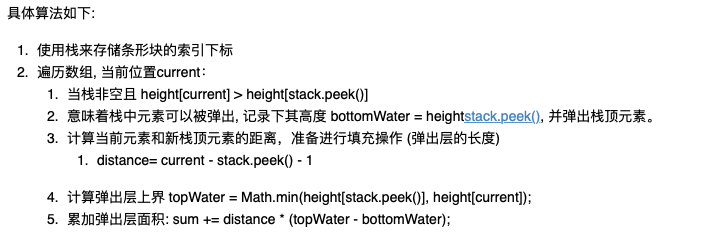
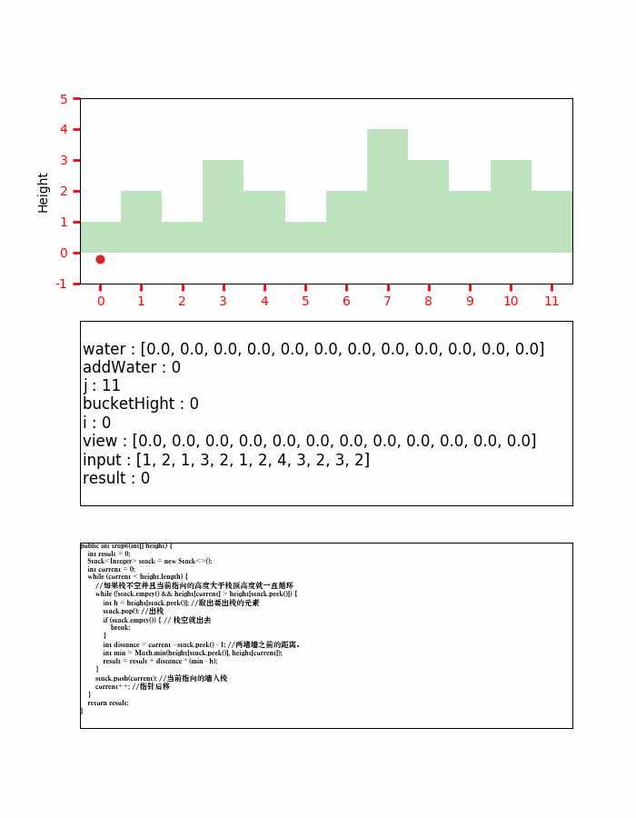
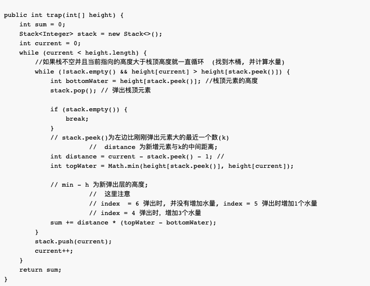
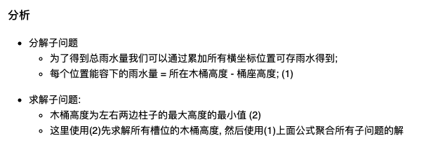
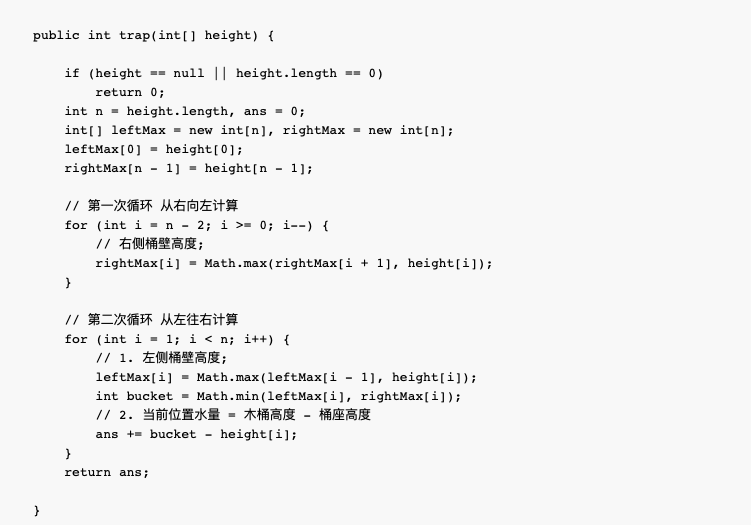

# 接雨水 解题笔记

* 难度：Hard

## 解题方法一：双指针法

* 题意可以类比为:

    二维的平面木桶, 它只有左右两个木块作为桶壁, 并且木桶的水位符合 "木桶原理",我们贪心从较低桶壁侧添加木块,这个过程有两种可能:
    1. 得到新桶壁:
        构建水位更高的木桶 --> 木桶高度提升
    2. 淹没在当前木桶中, 木块上水量为:
            水量 = 桶高 - 木块体积

* 动图理解如下：

* 注意:

    每次移动都是动较小的柱子,并且这个时候【总是可以】得到将要移动柱子的水量,因为最左右两边柱子上肯定没有水, 所以柱子是n的话，总共移动n-2次可以得到其中所有柱子上水量的解

* 代码实现如下：

## 解题方法二：使用栈

* 维护单调递增栈，当出现上升元素时(新增元素比栈顶的元素大), 去弹出元素并触发弹出一个水层, 接下来演示这个过程：

* 过程动图如下:

* 代码如下：

## 解题方法三：动态规划

* 代码如下：

